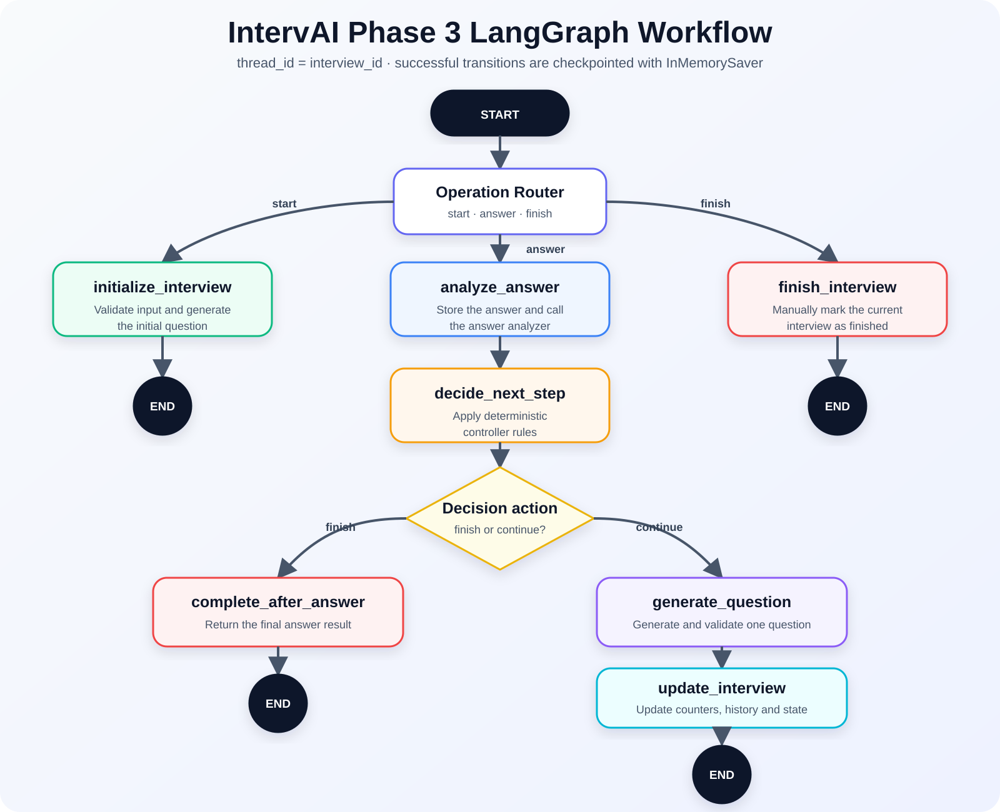

# IntervAI — Adaptive AI Technical Interview Platform

IntervAI creates a personalized technical interview from a candidate's resume and selected skills. It asks one question at a time, analyzes each answer, applies deterministic interview rules, and generates the next question according to the candidate's performance.

The repository contains only the adaptive interview workflow. The earlier fixed-question Phase 1 and Phase 2 implementations have been removed.

## Features

- PDF resume parsing and technical-skill extraction
- Candidate skill selection and interview configuration
- One-question-at-a-time adaptive interviews
- Structured answer analysis with Pydantic
- Deterministic difficulty and LangGraph routing decisions
- Checkpointed workflow state for each interview session
- Pydantic Logfire traces for FastAPI, Gemini, and LangGraph workflow stages
- Privacy-safe Pydantic validation metrics and request metadata
- Clarification, follow-up, deeper-topic, new-topic, and new-skill questions
- Text-to-Speech question playback
- Speech-to-Text candidate answers
- Editable answer transcripts
- Interview history and completion summary
- FastAPI backend and Streamlit frontend

## Architecture

```text
Streamlit frontend
        ↓ HTTP
FastAPI routes
        ↓
Interview workflow manager
        ↓
LangGraph state machine + checkpointer
        ├── Answer analyzer service
        ├── Deterministic controller
        └── Question generator service
        ↓
Validated interview state, history, and checkpoints
```

The responsibilities are separated as follows:

- **Routes** receive requests and return responses.
- **Workflow manager** connects the real analyzer, generators, and controller to the graph while keeping the API-facing functions stable.
- **LangGraph workflow** defines the shared state, nodes, conditional edges, lifecycle operations, and checkpoints.
- **Domain controller** applies predictable interview rules.
- **Services** call Gemini or process files and audio.
- **Schemas** validate application data.
- **Observability** records API latency, validation metrics, Gemini calls, workflow-stage timing, and exceptions in Pydantic Logfire.

## LangGraph Workflow



The graph accepts three operations:

- `start` routes to `initialize_interview`, creates the first question, and stores the initial checkpoint.
- `answer` routes through answer analysis and the deterministic controller. A conditional edge then completes the interview or generates and stores another question.
- `finish` routes directly to `finish_interview` for manual completion.

The interview ID is also the LangGraph `thread_id`, keeping each candidate's checkpoints separate. If a downstream node fails, the same answer can resume from the pending node without repeating successful upstream nodes.

## Project Structure

```text
IntervAI/
├── backend/
│   └── app/
│       ├── main.py
│       ├── core/
│       │   └── observability.py
│       ├── api/
│       │   └── v1/
│       │       ├── router.py
│       │       └── routes/
│       │           ├── health.py
│       │           ├── resumes.py
│       │           ├── interviews.py
│       │           └── speech.py
│       ├── domain/
│       │   └── interview/
│       │       └── controller.py
│       ├── schemas/
│       │   ├── interview.py
│       │   ├── resume.py
│       │   └── speech.py
│       ├── services/
│       │   ├── interview/
│       │   │   ├── answer_analyzer.py
│       │   │   └── question_generator.py
│       │   ├── resume/
│       │   │   └── parser.py
│       │   └── speech/
│       │       ├── speech_to_text.py
│       │       └── text_to_speech.py
│       └── workflows/
│           └── interview/
│               ├── graph.py
│               └── manager.py
├── frontend/
│   └── app.py
├── docs/
│   └── images/
│       └── langgraph-workflow.svg
├── tests/
│   ├── test_answer_analyzer.py
│   ├── test_controller.py
│   ├── test_question_generator.py
│   ├── test_manager.py
│   └── test_observability.py
├── .env.example
├── .gitignore
├── requirements.txt
└── README.md
```

## Adaptive Interview Workflow

### 1. Resume processing

1. The candidate uploads a PDF resume.
2. The resume service extracts the PDF text.
3. Gemini converts the text into structured resume information.
4. The candidate reviews and selects technical skills.

### 2. Interview start

1. The frontend sends the candidate name, selected skills, and question limits.
2. The workflow validates and cleans the input.
3. LangGraph runs the `initialize_interview` node.
4. The question generator creates the initial question.
5. The in-memory checkpointer stores the initial graph state under the interview ID.

### 3. Answer processing

1. The candidate types an answer or records it using the microphone.
2. Speech-to-Text produces an editable transcript when voice input is used.
3. The `analyze_answer` node evaluates the submitted answer.
4. The deterministic `decide_next_step` node selects the next action and difficulty.
5. A conditional edge routes to completion or question generation.
6. The `generate_question` node creates and validates the next question.
7. The `update_interview` node updates the state and history.
8. LangGraph checkpoints each successful transition. A failed node can be retried without repeating completed upstream nodes.

### 4. Completion

The graph routes to `complete_after_answer` when the deterministic controller returns `finish`. A manual request routes directly to `finish_interview`.

## Controller Actions

| Action | Purpose |
| --- | --- |
| `clarify` | Ask a simpler question about a weak or unclear answer |
| `follow_up` | Examine an important missing concept |
| `deepen_topic` | Test more advanced understanding |
| `change_topic` | Move to another topic within the current skill |
| `change_skill` | Begin evaluating another selected skill |
| `finish` | Complete the interview |

## API Endpoints

| Method | Endpoint | Purpose |
| --- | --- | --- |
| `GET` | `/` | Basic application health response |
| `POST` | `/upload-resume` | Extract candidate information and skills from a PDF |
| `POST` | `/text-to-speech` | Convert a question into speech |
| `POST` | `/speech-to-text` | Transcribe a recorded answer |
| `POST` | `/adaptive-interview/start` | Start an interview and generate the initial question |
| `POST` | `/adaptive-interview/answer` | Analyze an answer and return the next question |
| `GET` | `/adaptive-interview/{interview_id}` | Retrieve the current interview state |
| `POST` | `/adaptive-interview/finish` | Manually finish an interview |

## Environment

Copy `.env.example` to a local `.env` file and set:

```env
GOOGLE_API_KEY=your_google_api_key

LOGFIRE_TOKEN=your_logfire_write_token
LOGFIRE_SERVICE_NAME=intervai-api
LOGFIRE_ENVIRONMENT=development
LOGFIRE_SEND_TO_LOGFIRE=if-token-present
```

The `.env` file is ignored by Git and must not be committed. With the default `if-token-present` setting, the app starts normally without a Logfire token and sends telemetry only when `LOGFIRE_TOKEN` is available.

Install the project dependencies:

```bash
pip install -r requirements.txt
```

## Pydantic Logfire Observability

At startup, IntervAI configures Logfire before importing the API routes. This enables:

- FastAPI request duration, status, and exception traces
- Pydantic validation metrics
- Privacy-safe spans for the LangGraph start, analyze, decide, generate, and finish stages
- Google Gen AI request latency, token metadata, and failures
- Trace correlation by interview ID

Candidate names, answer text, resume content, transcripts, request headers, and uploaded audio are not added to custom span attributes. FastAPI request values are removed before export, and Gemini prompt/response content remains elided by default.

To view remote traces, create a Logfire project, copy its write token into `LOGFIRE_TOKEN`, start the backend, and open the Logfire Live view. Do not enable `OTEL_INSTRUMENTATION_GENAI_CAPTURE_MESSAGE_CONTENT` for real candidate interviews unless you intentionally want prompts and model responses exported.

## Run the Backend

From the repository root:

```bash
uvicorn backend.app.main:app --reload
```

The API will normally be available at:

```text
http://127.0.0.1:8000
```

FastAPI documentation:

```text
http://127.0.0.1:8000/docs
```

## Run the Frontend

In another terminal, from the repository root:

```bash
streamlit run frontend/app.py
```

## Tests

The current tests cover:

- Structured answer analysis
- Deterministic controller decisions
- Initial and adaptive question generation
- LangGraph state and lifecycle management
- Conditional continuation and completion routing
- Checkpoint recovery after a failed node
- Manual completion, including cancellation of a pending failed run
- Privacy-safe Logfire request attributes and configuration behavior

Run the test suite with:

```bash
pytest -v
```

## Current Limitations

- Interview sessions use LangGraph's in-memory checkpointer.
- Checkpoints are lost when the backend restarts; a database-backed checkpointer is still required for durable production persistence.
- No authentication or authorization is implemented.
- Model calls do not yet have centralized retries or fallback routing.
- Native LangSmith/OpenTelemetry export for complete LangGraph state trees is not enabled; privacy-safe Logfire workflow spans are used instead.
- Exact duplicate questions are rejected, but semantic duplicates are not detected.
- The final interview report is currently calculated in the frontend.

The next architectural steps are durable checkpoint storage, centralized structured logging, production sampling and alerting, and a model gateway with retry and fallback policies.
